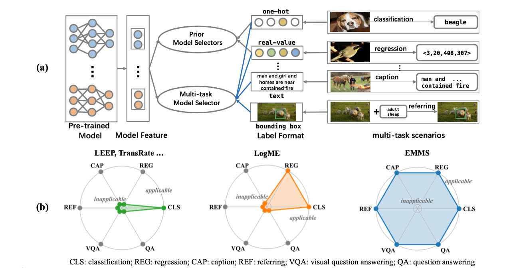

# Foundation Model is Efficient Multimodal Multitask Model Selector

This is the PyTorch implementation of the paper **Foundation Model is Efficient Multimodal Multitask Model Selector**, the paper is available at http://arxiv.org/abs/2308.06262


## Efficient Multimodal Multitask Model Selector

we propose an efficient multi-task model selector (EMMS), which employs large-scale foundation models to transform diverse label formats such as categories, texts, and bounding boxes of different downstream tasks into a unified noisy label embedding. EMMS can estimate a model’s transferability through a simple weighted linear regression, which can be efficiently solved by an alternating minimization algorithm with a convergence guarantee. Extensive experiments on 5 downstream tasks with 24 datasets show that EMMS is fast, effective, and generic enough to assess the transferability of pre-trained models, making it the first model selection method in the multi-task scenario. For instance, compared with the state-of-the-art method LogME enhanced by our label embeddings, EMMS achieves 9.0%, 26.3%, 20.1%, 54.8%, 12.2% performance gain on image recognition, referring, captioning, visual question answering, and text question answering, while bringing 5.13×, 6.29×, 3.59×, 6.19×, and 5.66× speedup in wall-clock time, respectively. 

<div align=center></div>


## Getting Started

### Data Preparation

- Download the downstream datasets to ./data/*.

### Pipeline of Model selection using transferability

The VQA task has the same pipeline as the categorization task, and the TQA and REC tasks have the same pipeline as the image caption task, so here is an example of these two tasks.

- Extract features of target data using pretrained models and different labels of target data

  - Image classification with CNN models

    ```
    python forward_feature_CNN.py
    ```

  - Image classification with ViT models

    ```
    python forward_feature_ViT.py
    ```

  - Image caption

    ```
    python forward_feature_caption.py
    ```

- Extract F-Labels of target data using different foundation models

  - image classification

    ```
    cd Label_embedding
    python clip.py
    python bert.py
    python gpt2.py
    ```

  - image caption

    ```
    cd Label_embedding
    python clip_sentence.py
    python bert_sentence.py
    python gpt2_sentence.py
    ```

- Compute transferability scores using EMMS and assess the effectiveness using model feature and F-labels we get before

  - image classification

    ```
    python evaluate_metric_cls_cpu_CNN.py  # for CNN
    python evaluate_metric_cls_cpu_ViT.py  # for ViT
    ```

  - image caption

    ```
    python evaluate_metric_caption_cpu.py
    ```

  If you need to use other baselines such as LogME, you can use the **metric parameter** to replace, here we provide LogME, TransRate, LEEP, NLEEP and other common baseline

